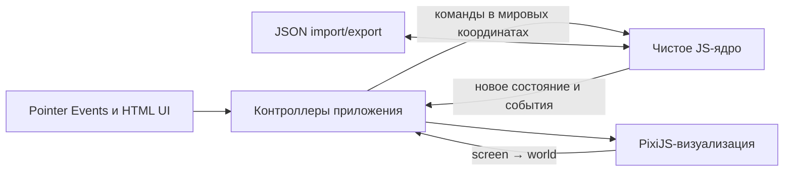

# Paper Cat World — дизайн-документ PoC

Статус: черновик 0.1

Платформа: браузер, компьютеры, планшеты и телефоны

Технологическая рамка: Vite, JavaScript, PixiJS, HTML/CSS

Масштаб разработки: инди-проект одного разработчика

## 1. Коротко об игре

Paper Cat World — уютная творческая песочница, имитирующая игру в бумажных кукол. Игрок раскрашивает котов, рисует и вырезает одежду, мебель и другие предметы, раскладывает их на большом виртуальном столе, обустраивает комнаты в тетрадях и использует сложенные листы как контейнеры, чемоданы и машины.

В PoC нет миссий, проигрыша, экономики и автономного поведения персонажей. Игровая ценность строится на свободном рисовании, физически понятных действиях с бумажными объектами и разыгрывании придуманных игроком сцен.

## 2. Игровая фантазия и принципы

Главная фантазия: «Я играю с собственным бумажным миром, и всё нарисованное мной становится его частью».

Принципы:

1. **Всё ощущается бумажным.** Объекты плоские, их можно перетаскивать, накладывать друг на друга, помещать внутрь сложенных листов и доставать обратно.
2. **Рисунок превращается в игровой объект.** Игрок не выбирает готовый стул из каталога, а рисует, обводит и вырезает собственный.
3. **Мир существует на одном столе.** Тетради, листы, машины, коты и вещи одновременно находятся в общей сцене; отдельного экрана комнаты нет.
4. **Вложенность — базовое свойство мира.** Предмет лежит в машине, машина может лежать внутри другой сложенной бумаги, а вся конструкция перемещается как единое целое.
5. **PoC остаётся игрушкой.** Система не пытается симулировать вес, толщину бумаги, реалистичную физику или поведение котов.
6. **Управление не зависит от мыши.** Все основные действия должны быть доступны через Pointer Events и иметь понятный сенсорный вариант без наведения курсора.

## 3. Основной игровой цикл PoC

1. Игрок осматривает стол и выбирает объект или место для творчества.
2. Рисует кота, одежду, мебель или другой предмет.
3. Обводит рисунок контуром и получает отдельную бумажную деталь.
4. Перетаскивает деталь на стол, в комнату, внутрь сложенного листа или на кота.
5. Открывает и закрывает тетради и листы, перевозит котов и перестраивает сцену.
6. Сохраняет весь мир в JSON-файл и позднее продолжает игру.

Это не обязательная последовательность: игрок может в любой момент вернуться к любому действию.

## 4. Пространственная модель мира

### 4.1. Стол

Стол — корневая двумерная поверхность мира. На нём могут лежать:

- закрытые и раскрытые тетради;
- обычные и сложенные листы;
- вложенные конструкции из нескольких листов;
- коты;
- вырезанные предметы.

Стол имеет конечный большой размер, но камера не ограничивает количество одновременно видимых игровых объектов. Игрок может приблизить отдельную комнату или отдалиться так, чтобы увидеть весь стол. Технический culling допустим, если он никак не меняет игровую модель.

### 4.2. Поверхности и локальные координаты

Каждый объект расположен не просто «в мире», а на конкретной поверхности:

- верхняя поверхность стола;
- текущий разворот тетради;
- внутренняя поверхность раскрытого листа;
- верхняя и нижняя наружные стороны сложенного листа;
- поверхность другого бумажного предмета, если это понадобится позднее.

Положение хранится в локальных координатах поверхности. Поэтому кот, находящийся в машине, автоматически перемещается вместе с машиной, а мебель в комнате — вместе с тетрадью.

Перекладывание объекта между поверхностями меняет его родительскую поверхность, но визуально сохраняет положение в мировых координатах в момент перекладывания.

### 4.3. Порядок наложения

У каждой детали есть локальный `zIndex`. При перетаскивании предмет обычно поднимается над соседними предметами своей поверхности. Слои разных поверхностей вычисляются с учётом вложенности.

PoC не симулирует столкновения: детали могут перекрываться. Для помещения внутрь контейнера достаточно, чтобы опорная точка детали оказалась в допустимой области внутренней поверхности.

## 5. Игровые сущности

### 5.1. Кот

Кот создаётся на основе стандартного шаблона-силуэта. Игрок рисует внешний вид на шаблоне, после чего получает отдельную бумажную фигурку.

В PoC кот:

- не двигается самостоятельно;
- не имеет потребностей, характеристик или анимации ходьбы;
- перемещается непосредственным перетаскиванием игроком;
- может находиться на столе, в комнате или внутри раскрытого сложенного листа;
- может носить несколько прикреплённых деталей одежды и экипировки.

Все коты используют одну каноническую систему координат шаблона. Это позволяет переносить одежду между котами без ручной подгонки.

### 5.2. Вырезанная бумажная деталь

Универсальная сущность для мебели, вещей, украшений, одежды и будущего оружия. Она состоит из:

- замкнутого контура вырезания;
- рисунка внутри контура;
- точки привязки;
- трансформации: положение, поворот и масштаб;
- необязательных данных привязки к шаблону кота.

В PoC различие между стулом, чашкой и обычной картинкой семантически не важно. Это бумажные детали, которым игрок сам придаёт смысл. Поведение вроде стрельбы появится после PoC как отдельные компоненты, добавляемые к тем же деталям.

### 5.3. Одежда и экипировка

Одежда рисуется на расширенном холсте с видимым шаблоном кота. Холст шире силуэта, поэтому шляпа, крылья или другое снаряжение могут выступать за границы тела.

После вырезания деталь запоминает положение относительно канонического шаблона. Когда игрок отпускает её над совместимым котом:

1. система определяет кота как цель;
2. деталь становится дочерним объектом кота;
3. её положение восстанавливается из координат исходного шаблона, а не из неточного места отпускания;
4. деталь перемещается, поворачивается и масштабируется вместе с котом.

Зоны тела (`head`, `face`, `body`, `paws`, `back`) используются для проверки совместимости и порядка слоёв. Контур предмета не обрезается по зоне: зона отвечает за привязку, а не за визуальные границы.

В PoC зона может определяться по тому, с какой размеченной областью шаблона больше всего пересекается контур. Позднее игроку можно позволить изменить автоматически выбранную зону.

### 5.4. Лист бумаги

Лист — универсальный складываемый бумажный объект, а не заранее заданный класс «машина» или «чемодан».

В PoC каждый складываемый лист:

- сгибается пополам по одной фиксированной центральной линии;
- имеет состояние `open` или `closed`;
- содержит рисунок внутреннего разворота;
- содержит рисунки верхней и нижней внешних сторон;
- в раскрытом состоянии показывает внутреннее содержимое;
- в закрытом состоянии показывает верхнюю внешнюю сторону, скрывает содержимое, но продолжает хранить его в модели;
- может сам находиться внутри другого раскрытого листа.

Для машины верхняя внешняя сторона обычно изображает крышу, нижняя — дно, а внутренний разворот — салон. В редакторе доступны все стороны листа. На столе в обычном виде нижняя сторона находится на поверхности и не видна; отдельное действие переворота можно добавить после PoC, не меняя модель данных.

Игровой смысл задаётся рисунком и использованием:

- нарисованный салон и пассажиры превращают лист в машину;
- вещи внутри превращают лист в чемодан;
- несколько вложенных листов образуют «многоэтажную машину».

Толщина содержимого не учитывается. Закрытие листа не уничтожает и не выталкивает находящиеся внутри объекты.

### 5.5. Многоэтажная машина

Многоэтажная машина не является специальной сущностью. Это результат рекурсивной вложенности:

```text
внешний сложенный лист
└── внутренняя поверхность
    ├── кот-пассажир
    └── внутренний сложенный лист
        └── внутренняя поверхность
            └── кот-пассажир
```

При закрытии внешнего листа всё дерево его содержимого становится невидимым. При перемещении внешнего листа всё дерево перемещается вместе с ним. Открытие вложенных листов возможно только тогда, когда видима поверхность, на которой они находятся.

Модель запрещает циклическую вложенность: лист нельзя положить внутрь самого себя или собственного потомка.

### 5.6. Тетрадь-дом

Тетрадь — бумажный контейнер с обложкой и набором разворотов. Каждый разворот представляет отдельную комнату, но остаётся частью общего стола, а не отдельной загружаемой локацией.

Тетрадь может быть:

- закрыта — видна обложка, содержимое комнат скрыто;
- открыта на выбранном развороте — видны обе страницы комнаты и находящиеся на них детали.

Перелистывание меняет активный разворот. Содержимое остальных комнат остаётся в модели, но не отображается. Число разворотов задаётся данными, а не зашивается в код. Для целевой версии используется формат дома из 12 листов; для первой вертикальной сборки достаточно трёх разворотов, поскольку механика от их количества не меняется.

## 6. Рисование и вырезание

### 6.1. Инструменты PoC

- кисть;
- ластик;
- выбор цвета;
- выбор размера кисти;
- отмена и повтор действия;
- инструмент замкнутого контура «ножницы».

Импорт внешних изображений, заливка, фигуры, текст, слои рисунка и сложные кисти находятся вне PoC.

### 6.2. Представление рисунка

Рисунок хранится не как зависимый от Canvas объект, а как независимый список штрихов:

```js
{
  id: "stroke-1",
  tool: "brush", // brush | eraser
  color: "#5b3a29",
  width: 8,
  points: [
    { x: 12.4, y: 31.8, pressure: 0.5 },
    { x: 13.1, y: 32.2, pressure: 0.6 }
  ]
}
```

Координаты штрихов локальны для поверхности рисования. PixiJS визуализирует эти данные и может кэшировать результат в текстуру, но кэш не является источником истины.

Ластик сохраняется как штрих с режимом удаления. Благодаря этому рисунок можно воспроизвести после загрузки JSON и отменять действия на уровне штрихов.

### 6.3. Создание детали

1. Игрок рисует на рабочей бумаге или шаблоне.
2. Выбирает ножницы и проводит замкнутый контур.
3. Система проверяет, что контур не самопересекается и имеет достаточную площадь.
4. Создаётся новая бумажная деталь с этим контуром и копией относящихся к нему штрихов.
5. При отображении контур используется как маска; штрихи не требуется физически разрезать на новые сегменты.
6. Для одежды дополнительно сохраняется трансформация относительно шаблона кота.

PoC может автоматически замыкать контур, если конец линии отпущен рядом с её началом. При явно незамкнутом контуре создание детали отменяется с понятной подсказкой.

## 7. Управление и UX

### 7.1. Камера

- масштабирование колёсиком мыши или жестом двумя пальцами;
- перемещение средней кнопкой/пробелом с перетаскиванием либо жестом по пустому месту;
- кнопка «Показать весь стол»;
- ограничение масштаба, чтобы не потерять сцену и не приблизиться до артефактов;
- положение камеры является состоянием интерфейса, а не правилом игрового ядра.

### 7.2. Базовое взаимодействие

В режиме игры:

- перетаскивание объекта одним указателем двигает объект;
- перетаскивание пустого места двигает камеру;
- жест двумя пальцами всегда управляет камерой;
- короткое нажатие выбирает объект;
- выбранный объект получает доступные действия: открыть/закрыть, перелистнуть, повернуть, удалить, редактировать рисунок;
- двойное нажатие на складываемый лист открывает или закрывает его как сокращённое действие.

В режиме рисования:

- один указатель рисует выбранным инструментом;
- два пальца перемещают и масштабируют холст;
- рисование происходит на отдельном сфокусированном рабочем холсте, чтобы жесты камеры стола не конфликтовали с кистью.

Интерфейс не должен зависеть от hover-состояний. Интерактивные элементы рассчитаны минимум на сенсорную область 44×44 CSS-пикселя. Системные жесты браузера внутри игрового canvas отключаются только там, где это необходимо.

### 7.3. Основные пользовательские сценарии

**Создать кота**

1. Нажать «Новый кот».
2. Раскрасить силуэт кистью и ластиком.
3. Подтвердить создание.
4. Получить фигурку рядом с выбранной областью стола.

**Создать мебель**

1. Открыть чистую рабочую бумагу.
2. Нарисовать предмет.
3. Обвести его ножницами.
4. Перетащить полученную деталь в комнату.

**Создать и надеть одежду**

1. Открыть шаблон одежды с силуэтом кота.
2. Нарисовать предмет, в том числе за границами силуэта.
3. Вырезать предмет.
4. Перетащить его на кота.
5. Увидеть автоматическое выравнивание по шаблону.

**Перевезти котов**

1. Открыть сложенный лист-машину.
2. Перетащить котов на внутреннюю поверхность.
3. Закрыть лист — пассажиры скрываются.
4. Перетащить машину к другой тетради.
5. Открыть машину и достать котов в другую комнату или на стол.

## 8. Архитектура

### 8.1. Главная граница

Игра разделена на независимое доменное ядро и браузерное представление:



Ядро не импортирует PixiJS и не использует DOM, Canvas, Pointer Events, размеры экрана, файловые API, часы браузера или глобальный генератор случайных значений. Оно принимает обычные JavaScript-объекты и возвращает обычные JavaScript-объекты.

### 8.2. Ответственность ядра

Ядро отвечает за:

- сущности и их идентификаторы;
- поверхности и рекурсивную вложенность;
- локальные и мировые трансформации;
- геометрию контуров и областей;
- порядок наложения;
- допустимость перекладывания между поверхностями;
- открытие и закрытие листов и тетрадей;
- выбор разворота тетради;
- прикрепление и снятие одежды;
- данные рисунков и контуров;
- команды undo/redo для изменений рисунка и мира;
- валидацию состояния;
- сериализацию, миграции версий и загрузку сохранений.

Ядро не решает, как выглядит бумага, насколько плавно анимируется сгиб, какой объект находится под экранным пикселем и какая кнопка показана в панели инструментов.

### 8.3. Ответственность приложения и визуализации

Слой приложения:

- преобразует координаты указателя из экранных в мировые и локальные;
- распознаёт drag, tap, pinch и рисование;
- превращает жесты в команды ядра;
- хранит временное состояние инструментов;
- управляет выбором объекта и камерой;
- запускает импорт и скачивание JSON-файла.

PixiJS-слой:

- строит display tree по состоянию ядра;
- отображает поверхности, рисунки и вырезанные маски;
- кэширует сложные рисунки в RenderTexture;
- выполняет визуальный hit testing и предлагает кандидатов контроллеру;
- анимирует открытие, закрытие и автоматическую привязку;
- скрывает невидимые ветви вложенных объектов;
- применяет culling и детализацию при дальнем масштабе.

HTML/CSS используется для панелей инструментов, выбора цвета, диалогов, меню сохранения и доступных подписей. Игровые объекты и стол отображаются в PixiJS canvas.

### 8.4. Поток команды

Пример перетаскивания кота в машину:

1. PixiJS hit test находит кота под указателем.
2. Контроллер запоминает начальную трансформацию и показывает временное перетаскивание.
3. При отпускании контроллер переводит экранную точку в координаты подходящих поверхностей.
4. Ядро получает `MoveEntity` с идентификатором кота, целевой поверхностью и локальной трансформацией.
5. Ядро проверяет видимость поверхности, отсутствие цикла и допустимость точки размещения.
6. Ядро возвращает новое состояние и событие `entityMoved` либо отказ с причиной.
7. PixiJS синхронизирует display tree и проигрывает короткую анимацию принятия или возврата.

Во время жеста визуализация может двигать временный sprite каждый кадр. Каноническая модель обновляется одной командой при завершении жеста, а не на каждом `pointermove`.

### 8.5. Предлагаемая структура исходников

```text
src/
  core/
    model/          сущности, поверхности, drawing documents
    geometry/       матрицы, полигоны, hit/containment tests
    commands/       операции над миром и валидация
    history/        undo/redo
    persistence/    JSON schema, миграции, validation
    index.js         публичный API ядра
  app/
    controllers/    жесты и пользовательские сценарии
    tools/          select, hand, brush, eraser, scissors
    store/          связь состояния ядра и UI
  rendering/
    pixi/            сцена, views, masks, texture cache, camera
  ui/
    components/     DOM-панели и диалоги
  assets/
    templates/      силуэт кота и разметка зон
  main.js
tests/
  core/
  integration/
```

Публичный API `core/index.js` — единственная точка, через которую приложение изменяет мир. Прямое изменение объектов состояния извне запрещено.

Минимальная форма API:

```js
const world = createWorld(config);
const result = applyCommand(world, {
  type: "moveEntity",
  entityId: "cat-1",
  targetSurfaceId: "sheet-1:inside",
  transform: { x: 120, y: 80, rotation: 0, scale: 1 }
});

if (result.ok) {
  render(result.world, result.events);
}
```

`applyCommand` детерминирован: одинаковое валидное состояние и одинаковая команда дают одинаковый результат. Создание идентификаторов и отметок времени выполняется снаружи и передаётся в команду. Это позволяет тестировать ядро без браузера и воспроизводить последовательности действий.

## 9. Модель данных и сохранение

### 9.1. Общая форма сохранения

JSON-файл самодостаточен: в нём находятся состояние мира, рисунки и версия схемы. Внешние пользовательские файлы в PoC не используются.

Упрощённый пример:

```json
{
  "format": "paper-cat-world",
  "schemaVersion": 1,
  "metadata": {
    "title": "Мой стол"
  },
  "world": {
    "table": { "width": 6000, "height": 4000 },
    "entities": {},
    "surfaces": {},
    "drawings": {}
  }
}
```

Сущности хранятся в нормализованных словарях по `id`, а не как глубоко вложенный JSON. Связи задаются через `surfaceId` и `hostEntityId`. Это упрощает перенос объектов, проверку циклов, миграции и частичное обновление представления.

Каждое изменение формата увеличивает `schemaVersion`. Загрузчик сначала проверяет структуру и ограничения, затем применяет последовательные миграции. Повреждённое сохранение не должно частично заменять текущий мир.

### 9.2. Доменное и временное состояние

В сохранение входят:

- сущности, их трансформации и порядок слоёв;
- родительские поверхности;
- состояния листов и тетрадей;
- активные развороты;
- штрихи, контуры и привязки одежды;
- пользовательские названия, если они будут добавлены.

Не обязаны входить:

- наведённый и выбранный объект;
- незаконченный жест;
- открытая панель;
- кэши PixiJS и сгенерированные текстуры;
- история undo/redo предыдущей сессии;
- положение камеры. Его можно добавить в отдельный необязательный блок `view`.

### 9.3. Автосохранение и файл

Обязательная функция PoC — экспорт и импорт `.json`. Дополнительно браузер хранит последнее состояние локально для восстановления после перезагрузки страницы. Файловое сохранение остаётся явным действием игрока и работает без сервера или аккаунта.

## 10. Инварианты ядра

Состояние мира считается корректным, если:

1. каждый идентификатор уникален;
2. каждая размещённая сущность ссылается на существующую поверхность;
3. каждая внутренняя поверхность ссылается на существующего владельца;
4. граф владения поверхностями не содержит циклов;
5. закрытый контейнер сохраняет содержимое, но делает его недоступным для прямого взаимодействия;
6. одновременно видим только активный разворот открытой тетради;
7. прикреплённая одежда ссылается на существующего кота и совместимую зону;
8. контур вырезанной детали замкнут и имеет положительную площадь;
9. числовые координаты конечны и не содержат `NaN`;
10. загрузка JSON либо создаёт полностью валидный мир, либо не меняет текущий.

Эти правила тестируются без запуска браузера и PixiJS.

## 11. Границы PoC

### Входит

- большой стол, pan и zoom;
- несколько одновременно лежащих объектов;
- создание и раскрашивание кота;
- кисть, ластик, undo/redo;
- обводка и создание вырезанной детали;
- свободное перемещение, поворот и наложение деталей;
- создание одежды на шаблоне и автоматическая привязка к коту;
- складываемый пополам лист с внешним и внутренним рисунком;
- помещение объектов внутрь листа и извлечение;
- рекурсивно вложенные листы;
- тетрадь с закрытым состоянием и переключаемыми комнатами-разворотами;
- JSON export/import и локальное аварийное автосохранение;
- управление мышью, стилусом и базовыми touch-жестами;
- тесты доменной геометрии, вложенности и round-trip сохранения.

### Не входит

- миссии, сюжет и прогресс;
- автономное поведение котов;
- стрельба и другое функциональное оружие;
- физика, столкновения, вес и толщина бумаги;
- произвольные и сложные схемы сгибов;
- анимация ходьбы персонажей;
- мультиплеер и совместное редактирование;
- сервер, аккаунты и облачные сохранения;
- обмен творениями;
- импорт внешних изображений;
- продвинутый графический редактор;
- процедурное распознавание того, что именно нарисовал игрок.

## 12. Проверяемые сценарии PoC

PoC считается доказавшим идею, если выполняются все сценарии:

1. Игрок создаёт двух по-разному раскрашенных котов, сохраняет мир, загружает JSON и получает визуально те же фигурки.
2. Игрок рисует шляпу шире головы, вырезает её и надевает по очереди на обоих котов; шляпа каждый раз одинаково выравнивается и не обрезается силуэтом.
3. Игрок рисует стул, вырезает его, помещает в видимый разворот тетради и перемещает тетрадь по столу; стул движется вместе с комнатой.
4. Игрок помещает котов во внутреннюю поверхность машины-листа, закрывает её, переносит к другой тетради, открывает и достаёт пассажиров.
5. Игрок кладёт один раскрывающийся лист внутрь другого, размещает кота во внутреннем листе и перемещает всю конструкцию без потери связей.
6. При попытке положить внешний лист внутрь его собственного потомка ядро отклоняет действие, а интерфейс возвращает объект на исходное место.
7. На сенсорном экране игрок может рисовать одним пальцем или стилусом, масштабировать двумя пальцами и перетаскивать объекты без действий, доступных только через hover.
8. После сильного отдаления виден весь стол и содержимое всех раскрытых на нём комнат и листов.

## 13. Этапы реализации

Подробные инженерные планы, общий технический контракт и критерии готовности собраны в [индексе планов](plans/README.md). Этапы выполняются последовательно: следующий начинается после checklist предыдущего.

### Этап 1. Геометрическое ядро

[Подробный план этапа 1](plans/01-geometric-core.md)

- модель сущностей и поверхностей;
- локальные/мировые трансформации;
- перемещение между поверхностями;
- рекурсивная видимость;
- проверки циклов;
- модульные тесты.

Результат: модель вложенной бумажной сцены работает без рендера.

### Этап 2. Стол и манипуляция

[Подробный план этапа 2](plans/02-table-interaction.md)

- Vite-приложение и PixiJS-сцена;
- камера, pan/zoom;
- выбор, перетаскивание, поворот;
- временные тестовые прямоугольники вместо рисунков;
- мышь и touch.

Результат: бумажные объекты можно раскладывать и вкладывать друг в друга.

### Этап 3. Рисование и вырезание

[Подробный план этапа 3](plans/03-drawing-and-cutting.md)

- кисть, ластик, цвета, размер;
- stroke storage и кэш текстур;
- undo/redo;
- контур ножниц и PixiJS mask;
- создание универсальной детали.

Результат: собственный рисунок становится отдельным игровым объектом.

### Этап 4. Коты и одежда

[Подробный план этапа 4](plans/04-cats-and-clothing.md)

- шаблон кота;
- создание фигурки;
- расширенный шаблон одежды;
- зоны и автоматическое выравнивание;
- attach/detach.

Результат: доказана основная фантазия бумажной куклы.

### Этап 5. Листы и тетради

[Подробный план этапа 5](plans/05-sheets-and-notebooks.md)

- состояния open/closed;
- внутренние и внешние поверхности;
- анимация сгиба;
- вложенные листы;
- тетрадь, обложка, развороты и комнаты.

Результат: котов можно перевозить между домами в нарисованных машинах.

### Этап 6. Сохранение и доводка PoC

[Подробный план этапа 6](plans/06-persistence-and-polish.md)

- версионированный JSON;
- импорт, экспорт и локальное восстановление;
- проверка всех приёмочных сценариев;
- оптимизация кэшей и дальнего масштаба;
- мобильная раскладка UI и обработка ошибок.

## 14. Технические риски

### Производительность пользовательских рисунков

Тысячи точек в штрихах дороги для постоянной перерисовки. Источник истины остаётся в ядре, а PixiJS после завершения штриха кэширует поверхность. Кэш инвалидируется только при изменении соответствующего рисунка. Далёкие объекты отображаются из уменьшенных кэшей.

### Конфликт рисования и жестов камеры

На сенсорных экранах один палец не может одновременно рисовать и двигать камеру. Режим рисования открывается как сфокусированный редактор; один указатель рисует, два управляют камерой холста.

### Сложность вложенных координат

Ошибки при reparenting могут визуально «прыгать» объектами. Все преобразования реализуются матрицами в ядре и покрываются тестами: `local → world → new local` должно сохранять мировую позу с заданной погрешностью.

### Слишком широкий PoC

Критический вертикальный срез — кот, одна одежда, один вырезанный предмет, один складываемый лист, одна тетрадь и round-trip JSON. Количество шаблонов, комнат и декоративных возможностей увеличивается только после прохождения этого среза.

## 15. Решения, оставленные параметрами

Следующие детали не должны блокировать реализацию ядра:

- точное физическое соответствие «12 листов» числу игровых разворотов;
- размер стола и бумаги;
- число комнат в стартовой тетради;
- набор и приоритет зон одежды;
- допустимый диапазон поворота и масштаба деталей;
- минимальная доля детали, необходимая для помещения на внутреннюю поверхность.

Они задаются конфигурацией или данными шаблонов и уточняются после первого интерактивного прототипа.

## 16. Направление после PoC

Архитектура должна позволить позднее добавить компоненты поведения, не превращая нарисованные предметы в отдельную несовместимую систему. Например, бумажная деталь остаётся деталью, но получает компонент `weapon`, содержащий точку вылета, тип снаряда и правила активации. Аналогично можно добавить сиденья машины, интерактивную мебель, миссии и действия котов.

Первое расширение следует выбирать только после проверки того, что рисование, вырезание, одевание и вложенные листы уже доставляют удовольствие сами по себе.
